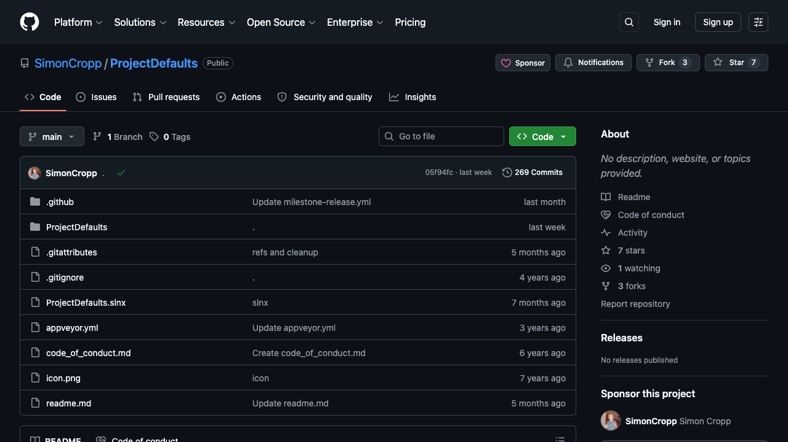
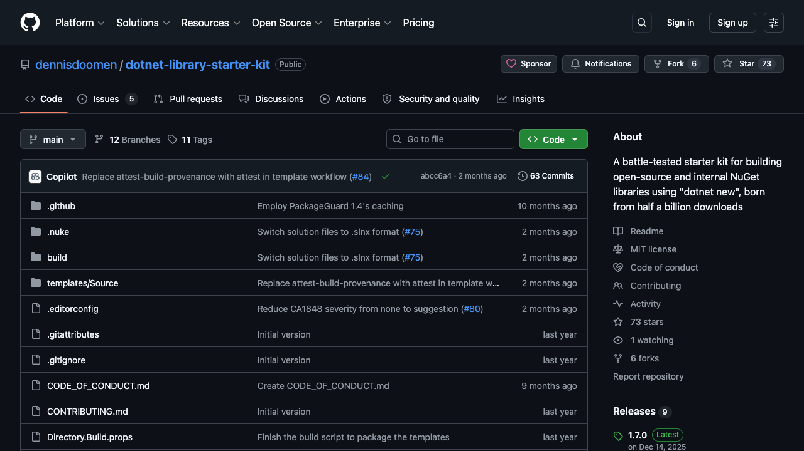
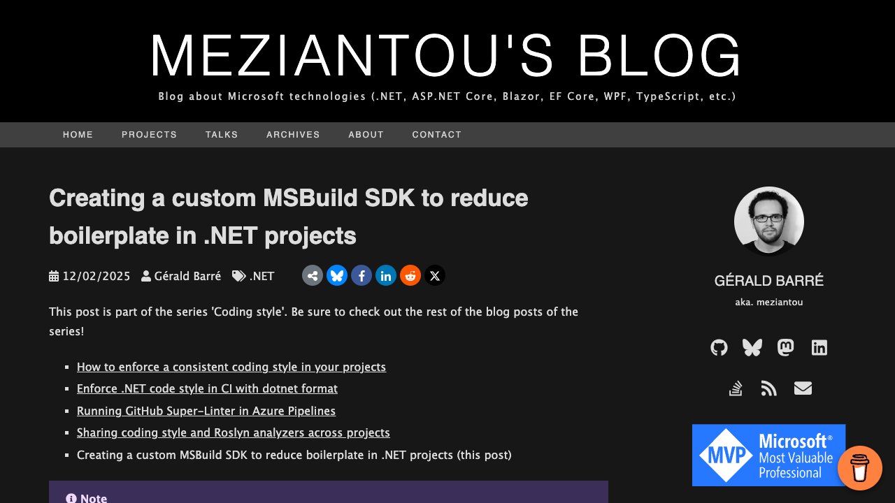
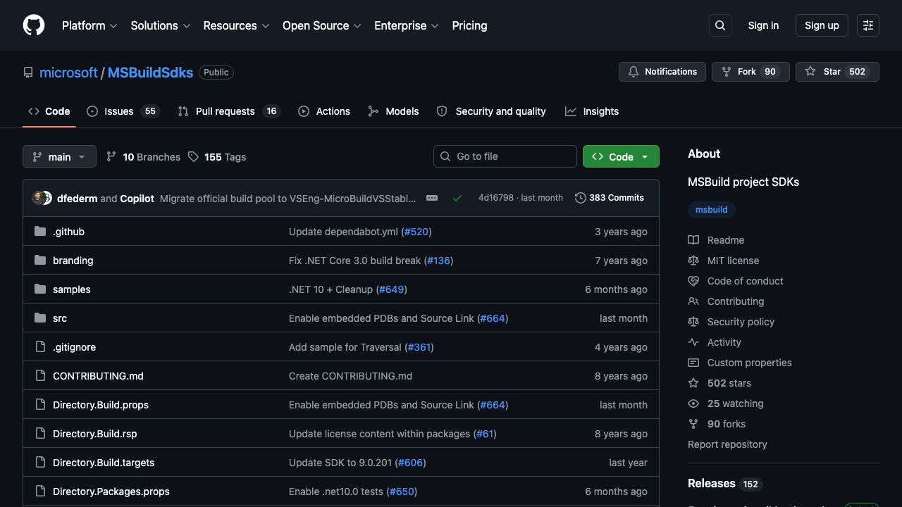

<!-- _class: lead -->
<!-- _paginate: false -->


---

## We All Want "Good Code"

- Many projects, similar quality requirements
- But what does "good" actually mean?

---

## Related Aspects

- Project properties
- Analyzer packages
- Analyzer severity
- Code style
- Package infrastructure
- Custom Roslyn components
- Build targets

---

## Meanwhile, Your Repositories...

- A has `Nullable=enable` - but no analyzers
- B has `NoWarn=CS8618;CA1062` - nobody knows why
- C uses `Nullable=annotations` - see JIRA-4521
- D has no `.editorconfig` - random reformats on every commit
- E was started fresh - copied settings from A... or was it B?
- F was started in a hurry - "we'll add that stuff later"

---

## Configuration Drift

- Random updates accumulate
- "Let's not touch this"
- No single source of truth
- No organization-wide standard
- Usually not tested

---

## Solution 1: Directory.Build.(props | targets)

- Centralizes settings per repository
- MSBuild auto-imports them
- No more editing every `.csproj`
- Still need to copy across repositories

---

## Solution 2: NuGet with build/ Folder

- Self-contained and versioned
- Auto-imported via `PackageReference` on restore
- No `PackageReference` from props/targets

---

<!-- _paginate: false -->



---

## Solution 3: Project Templates

- `PackageType=Template`
- Installed via `dotnet new install`
- `dotnet new` with custom templates
- Re-apply with `--force` for updates
- Changes are traceable in git
- Customizations are cumbersome

---

<!-- _paginate: false -->



---

<!-- _class: lead -->

## What If...

...you could define your organization's "golden path" **once**?

---

<!-- _paginate: false -->



---

<style scoped>
section [data-marpit-advanced-background-container] figure {
  background-position: left center !important;
}
</style>


## You've Been Using SDKs All Along

```xml
<!-- Console app, library -->
<Project Sdk="Microsoft.NET.Sdk">

<!-- Razor components -->
<Project Sdk="Microsoft.NET.Sdk.Razor">

<!-- ASP.NET Core -->
<Project Sdk="Microsoft.NET.Sdk.Web">
```

---

## Behind the Sdk Attribute

```xml
<Project>

  <Import Project="Sdk.props" Sdk="Microsoft.NET.Sdk" />
  
  <!-- Directory.Build.props -->

  <!-- your .csproj content here -->

  <!-- Directory.Build.targets -->

  <Import Project="Sdk.targets" Sdk="Microsoft.NET.Sdk" />

</Project>
```

---

<!-- _paginate: false -->



---

## It's Just a NuGet Package

- `PackageType=MSBuildSdk`
- Resolved via `NuGetSdkResolver`
- `Sdk/Sdk.props` (defaults)
- `Sdk/Sdk.targets` (enforcements)

---

## Locking It Down

<div class="columns">
<div class="left">

**Centralized**

```json
// global.json
{
  "msbuild-sdks": {
    "Org.BuildSdk": "1.0.0"
  }
}
```

</div>
<div class="right">

**Per-project**

```xml
<Project Sdk="Org.BuildSdk/1.0.0">
  ...
</Project>
```

</div>
</div>

---

## Scripts Get Standards Too

```csharp
#!/usr/bin/env dotnet run
#:sdk Org.ConsoleSdk/1.0.0

Console.WriteLine("Hello!");
```

---

## Testing Your SDK

- No mocking - actual MSBuild execution
- Create solutions and projects programmatically
- Add C# source files with intentional violations
- Run real `dotnet build` / `dotnet pack`
- Also supports IDE experience

---

## What You Can Assert

- `ExitCode` and `Output`
- MSBuild binary logs using `MSBuild.StructuredLogger`
- SARIF structured diagnostics
- NuGet package introspection using `NuGet.Packaging`

---

## Live: DemoSdk

- Packaged using `Microsoft.Build.NoTargets`
- Illustrates props vs targets evaluation time

---

## Live: BuildSdk

- `LangVersion`, `Nullable`, `ImplicitUsings`
- Debug vs Release enforcements
- Auto-detect CI environments for `ContinuousIntegrationBuild`

---

## SDK Layering

```xml
<!-- Sdk/Sdk.props -->
<Import Project="Sdk.props" Sdk="Org.BuildSdk" />

<!-- your additional props here -->
```

```xml
<!-- Sdk/Sdk.targets -->
<!-- your additional targets here -->

<Import Project="Sdk.targets" Sdk="Org.BuildSdk" />
```

---

## Live: CodeStyleSdk

- Extends `Org.BuildSdk` (SDK layering)
- Bundles `.editorconfig` for formatting and naming
- Includes ReSharper conventions

---

## Live: AnalyzerSdk

- Extends `Org.CodeStyleSdk` (more layering)
- Bundled analyzer packages
- `.globalconfig` for analyzer severities
- Custom organization analyzers

---

## Live: PackageSdk

- Enables documentation
- Auto-detect README.md and LICENSE
- SourceLink + embedded PDBs
- NuGet security audit enabled
- SBOM generation on CI builds

---

## SDK Composition

```xml
<Project Sdk="Org.AnalyzerSdk;Org.PackageSdk">
```

```csharp
#:sdk Org.AnalyzerSdk
#:sdk Org.PackageSdk
```

---

## Live: ObservabilitySdk

- Runtime lib with default configs for logging, metrics, traces
- Interceptor hooks into `Build()` method

---

## Live: ConsoleSdk

- Import and alias `Spectre.Console`
- Additional members
- Entry point orchestration

---

## Limitations

- **Harder introspection** - layered settings can be opaque
- **Version drift** - different projects may pin different SDK versions
- **No auxiliary files** - can't ship workflow YAMLs or scripts

---

## Conclusion

- MSBuild SDKs for "golden path" build configs
- Version it, test it, ship it
- Stop copying files

---

<!-- _class: lead -->

# Thank You!

**github.com/matkoch/msbuild-sdks**
